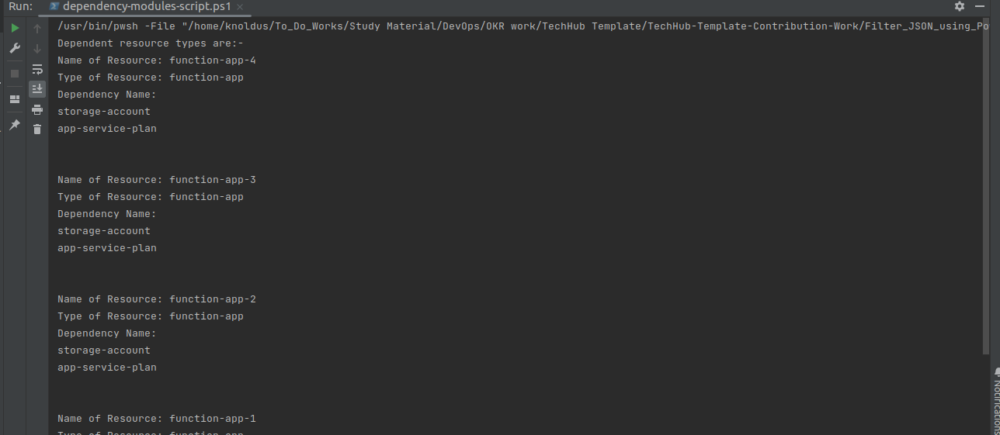

## Description

In this template we will filter the JSON file values for particular elements so that we can utilise it them.
Like we are filtering for the list of dependent resources and non-dependent resources.

---

### Steps

* Change the permission of the file `chmod a+x <file-name>.sh`
* Go to the terminal and run the command `./<file-name>.sh` or run the script from any ID like Visual Code or IntelliJ.

---

### Outputs

1. Here , In this Output we are getting list of all dependent modules and their resource types from the JSON:

2. Here , In this Output we are getting list of all non-dependent modules and their resource types from the JSON:

---